# Хлебоград — Система управления производством хлебобулочных изделий

## О проекте

«Хлебоград» — это веб-приложение для автоматизации управления производственными процессами хлебобулочного предприятия.

Система предназначена для учёта и управления производственными заводами, сотрудниками, ингредиентами и производственными партиями, а также для контроля ролей пользователей и выполнения административных функций.

### Функциональные возможности

* Управление изделиями (CRUD)
* Управление заводами (CRUD)
* Управление сотрудниками (CRUD) с распределением по ролям и заводам
* Управление ингредиентами (CRUD) с учётом количества на складе
* Управление производственными партиями (CRUD)
* Назначение сотрудников на конкретные заводы
* Учёт производственных процессов и связей между сущностями
* Разграничение доступа по ролям пользователей:

  * Администратор (CEO)
  * Менеджер завода
  * Сотрудник
* Авторизация и аутентификация пользователей (JWT)

---

### Роли пользователей

| Роль                | Возможности                                                                 |
| ------------------- | --------------------------------------------------------------------------- |
| Сотрудник           | Просмотр данных, связанных с назначенным заводом                            |
| Менеджер            | Управление сущностями своего завода (сотрудники, производство, ингредиенты) |
| Администратор (CEO) | Полный доступ ко всем данным и управлению системой                          |

---

## Технологический стек

| Компонент      | Технология                                          |
| -------------- | --------------------------------------------------- |
| Фронтенд       | React, JavaScript, SASS                             |
| Бэкенд         | Node.js, Express                                    |
| База данных    | SQLite                                          |
| Аутентификация | JWT (access токен), httpOnly cookie (refresh токен) |

---

## Установка и запуск

### Требования

* Node.js (версия 16+)
* npm или yarn

---

### 1. Клонирование репозитория

```bash
git clone https://github.com/Rin-RGB/ZhulevaDA_CourseProject.git
cd ZhulevaDA_CourseProject
```

Установите зависимости с помощью команды `npm install`, после чего запустите приложение с помощью команды `npm run dev`

Документация сервера будет доступен по адресу:

```
http://localhost:3000/api-docs
```

Приложение будет доступно по адресу:

```
http://localhost:8000
```

---

## Тестовые данные

### Администратор (CEO)

| Email                                     | Пароль   |
| ----------------------------------------- | -------- |
| [ceo@example.com](mailto:ceo@example.com) | admin123 |

---

### Остальные пользователи

Почта | Имя | Пароль
|----------|-----|----------|
faeri190511@gmail.com |	Дарья Жулева | `myPass123`
man@example.com | Менеджер Заводила | `manage123`
test@example.com | Тестировщик Тестиков | `test123`

---

## API Документация

Полная документация API доступна в файле `API.md`.

### Основные эндпоинты

| Метод  | Эндпоинт         | Описание                   | Доступ                   |
| ------ | ---------------- | -------------------------- | ------------------------ |
| POST   | `/auth/register` | Регистрация пользователя   | Руководитель                |
| POST   | `/auth/login`    | Авторизация                | Публичный                |
| GET    | `/factories`     | Список заводов             | Руководитель / Администратор |
| GET    | `/employees`     | Список сотрудников         | Руководитель / Администратор                |
| GET    | `/ingredients`   | Список ингредиентов        | Любой авторизованный пользователь                |
| GET    | `/batches`       | Список партий производства | Любой авторизованный пользователь                |
| POST   | `/batches`       | Создание партии            | Руководитель / Администратор |
| PUT    | `/factories/:id` | Обновление завода          | Руководитель/ Администратор            |
| DELETE | `/factories/:id` | Удаление завода            | Администратор            |

## Примеры интерфейса

### 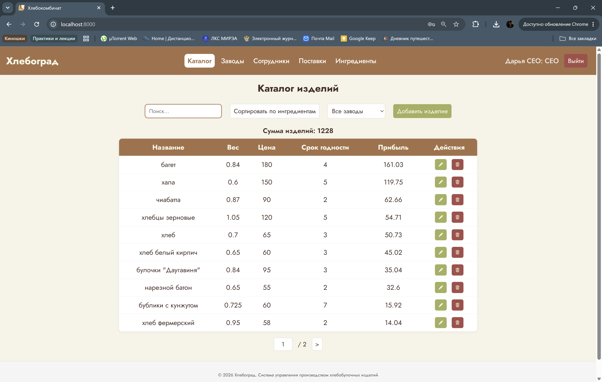

### 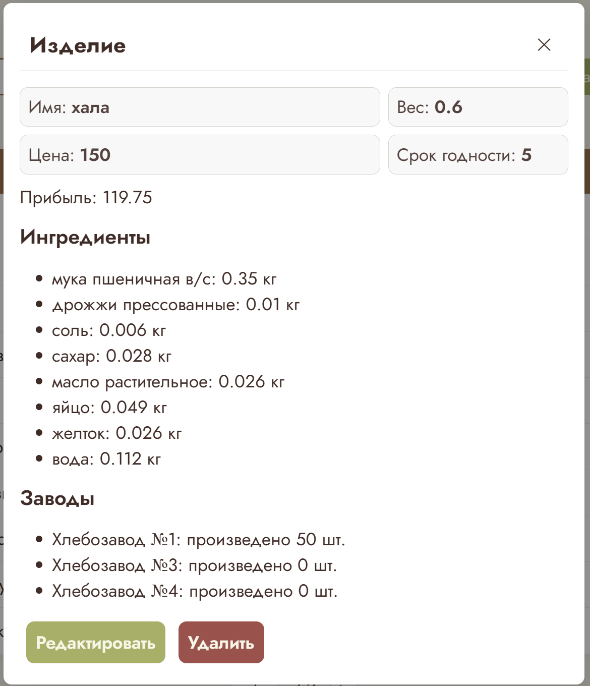

### 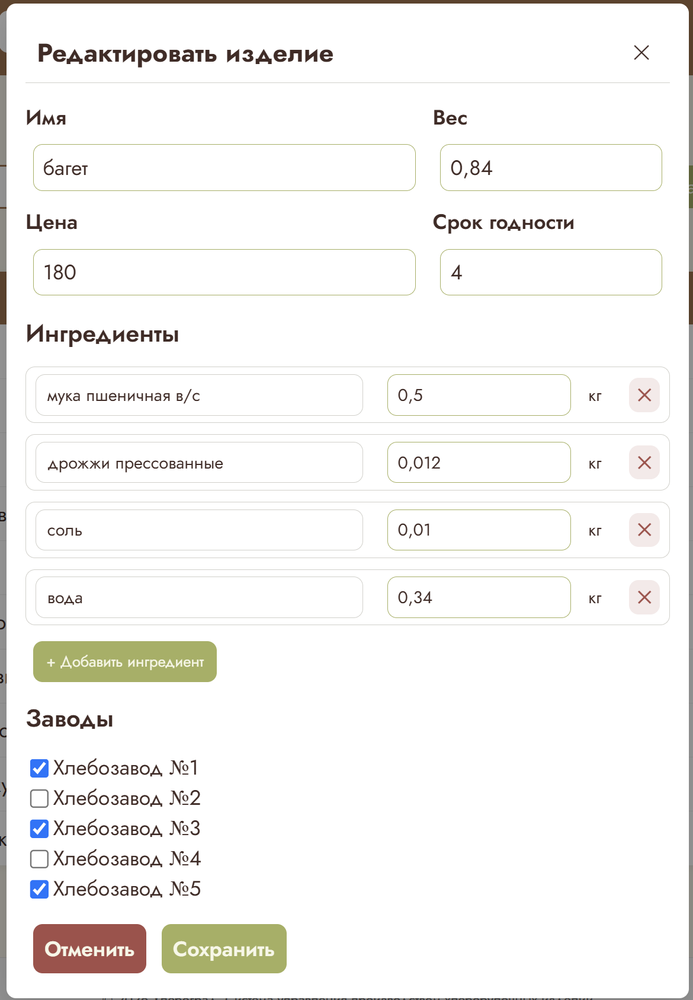

### 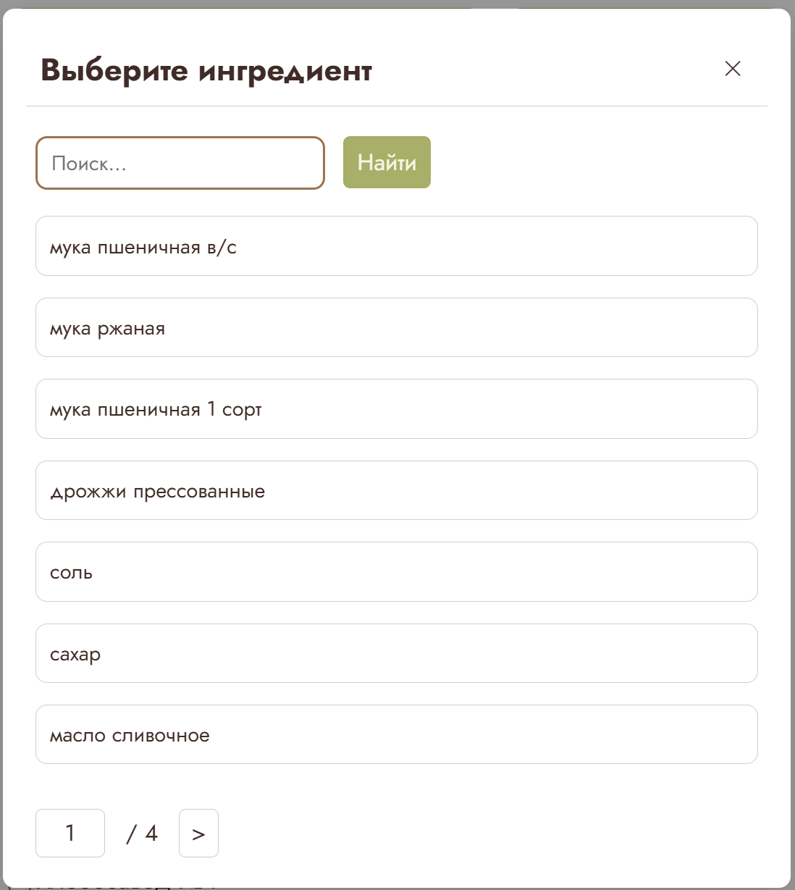

### 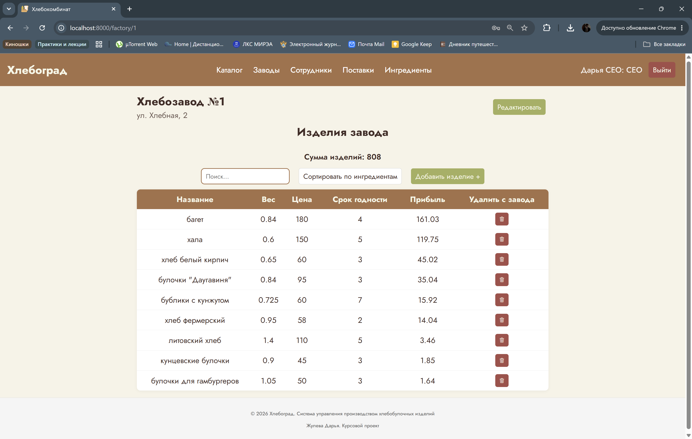

### 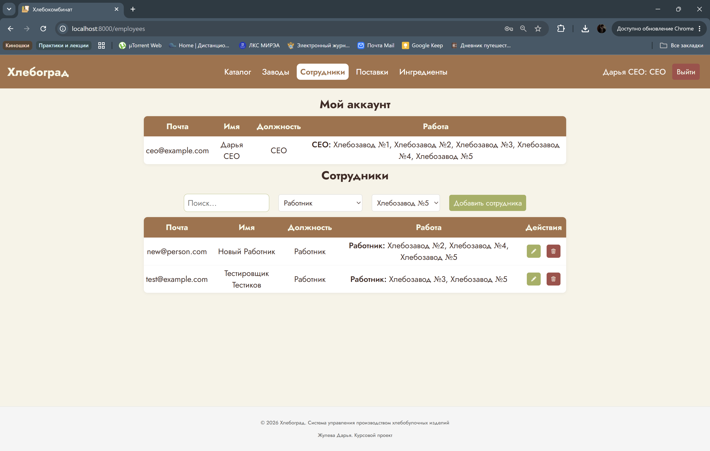

### 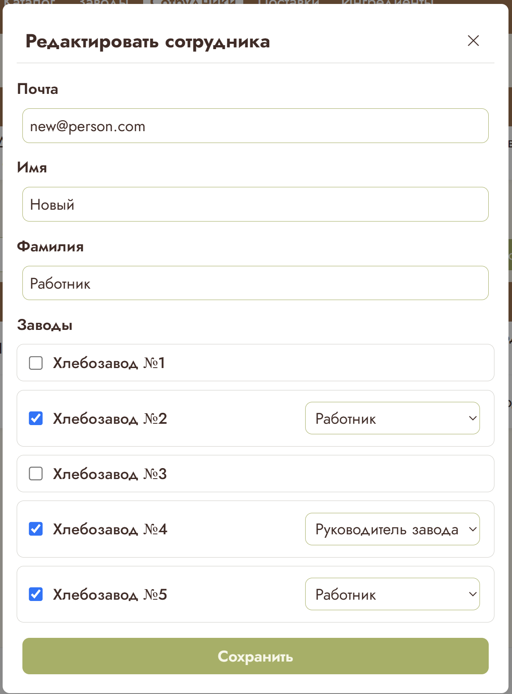

### 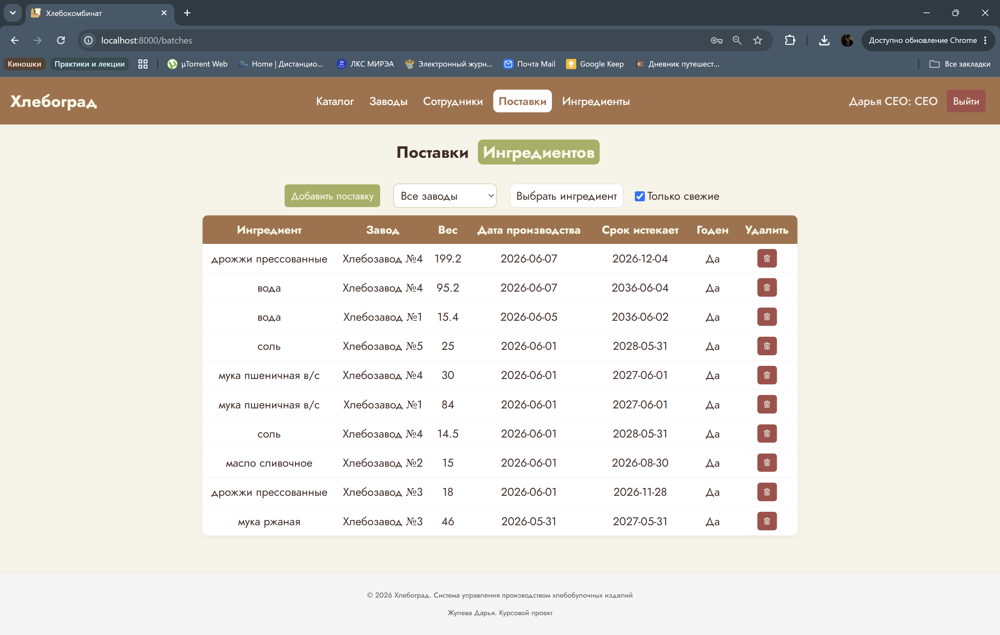

Чтобы сменить страницу "поставки ингредиентов" на страницу "поставки изделий" и наоборот необходимо кликнуть на выделенное слово в заголовке страницы

### 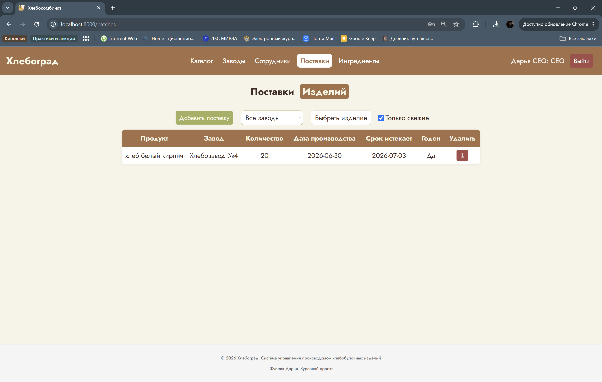

### 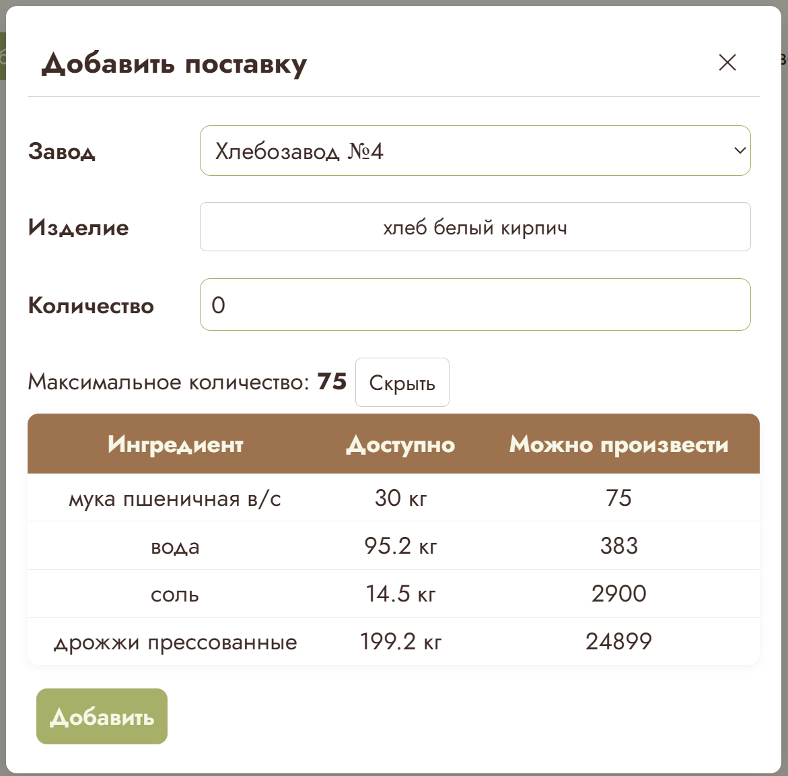

### 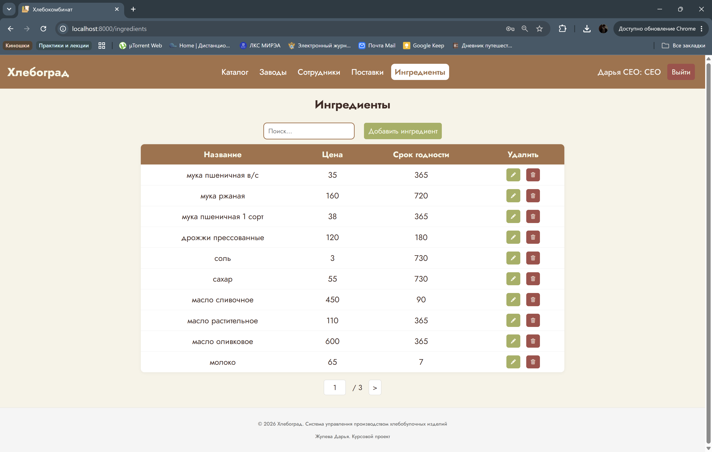
